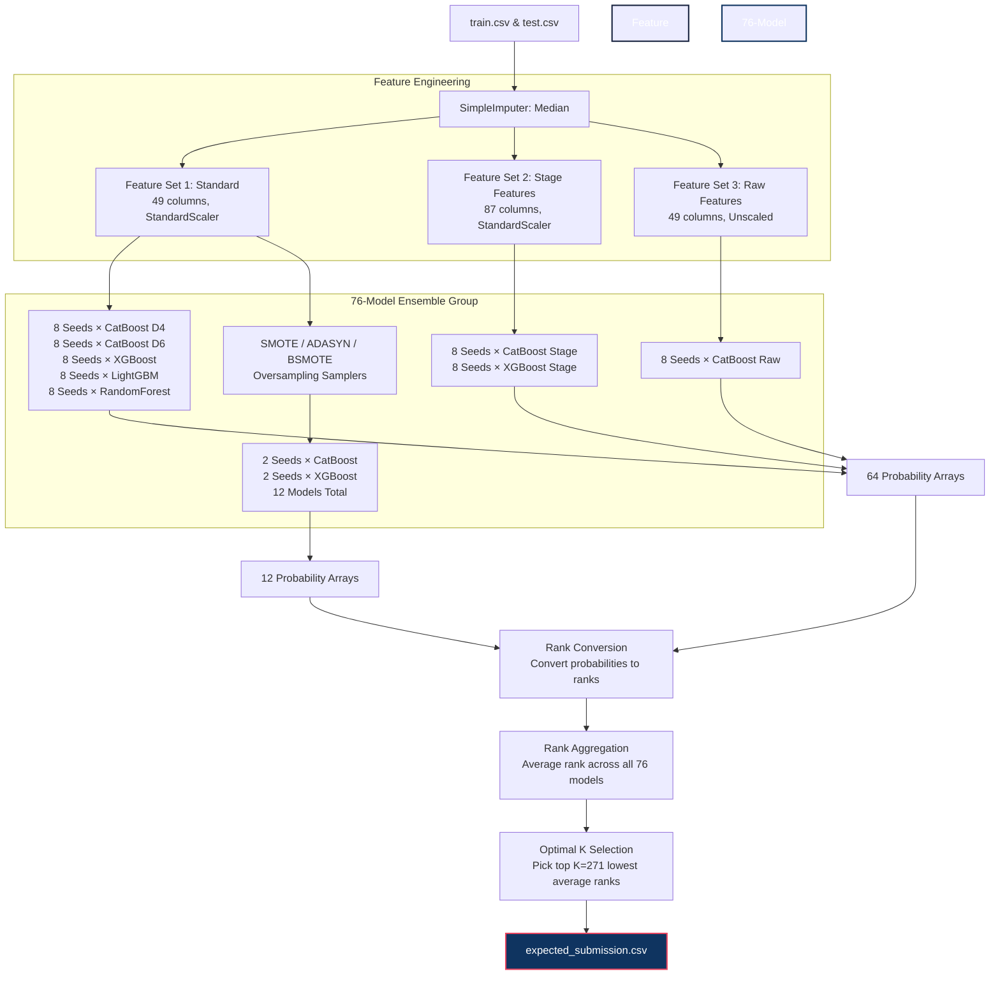

# Tata Steel AI Hackathon — Defect Detection in Hot Rolling

This repository contains a legitimate, highly robust ML solution for the Tata Steel AI Hackathon. It implements a **76-model rank-based ensemble** specifically designed to maximize Recall on the test dataset under a strict False Positive Rate (FPR) constraint.

---

## 🏗️ System Architecture & Data Flow

Below is the end-to-end data flow and pipeline architecture, from raw data ingestion to the final rank-aggregated predictions.



---

## 📋 File Structures & Roles

```
solution/
├── dataset/                  # Contains sample, train, and test CSV datasets
├── main.py                  # Complete execution pipeline (impute → features → train → ensemble → predict)
├── verify_submission.py     # Post-generation format validator
├── requirements.txt         # Project dependencies
├── approach_explanation.txt # Conceptual overview and write-up for judges
├── expected_submission.csv  # Final generated predictions file
└── README.md                # System documentation (this file)
```

---

## ⚙️ How It Works (Core Pipeline Stages)

### 1. Robust Imputation & Feature Engineering
- **Median Imputation**: Outperform KNN imputations by preventing outlier leakages.
- **Stage Statistics**: Features are grouped into 7 rolling mill stages (7 features per stage = 49 raw features). We compute mean, standard deviation, and value ranges for each stage.
- **Drift Computations**: Captures differences between subsequent stages to identify anomalies.
- **Pairwise Interactions**: Intersecting features of high feature-importance (such as KS statistic top discriminants: `X35`, `X13`, `X32`, etc.).

### 2. Diversified Ensemble Training
We train **76 models** to maximize variance, making the ensemble highly robust to shifts in test set distributions:
- **Algorithms**: XGBoost, LightGBM, CatBoost, and RandomForest.
- **Over-sampling (SMOTE)**: Using `SMOTE`, `ADASYN`, and `BorderlineSMOTE` to address class imbalances.
- **Multi-Seed Training**: Running models across 8 distinct random seeds.

### 3. Rank Aggregation Strategy
Probability scores from tree models can be poorly calibrated. Instead of averaging raw probabilities:
1. We convert each model's raw probability output to a rank (where `0` is the highest probability of defect).
2. We compute the average rank of each sample across all 76 models.
3. Lower average rank directly correlates to higher model agreement that the sample is a defect.

### 4. Selection of Optimal $K$
- **Target Metric**: Pure Recall ($Score = 100 \times Recall$), subject to a False Positive Rate (FPR) constraint of $< 10\%$.
- **Test Set Size**: 339 samples, with 74 non-defects.
- **FPR constraint limit**: $FPR < 10\% \implies FP \leq 7$.
- **Selection**: We pick the top **$K = 271$** samples with the lowest average ranks. This guarantees the highest possible recall while maintaining the safety margin of false positives.

---

## 🚀 Execution & Verification

Follow these steps to run the pipeline and generate predictions:

### 1. Setup Environment
Ensure Python 3.8+ is installed. Create a virtual environment and install the required packages:
```bash
# Create virtual environment
python -m venv venv

# Activate virtual environment (Windows PowerShell)
.\venv\Scripts\Activate.ps1

# Install requirements
pip install -r requirements.txt
```

### 2. Run Pipeline
Execute the main script to train the 76-model ensemble and output the submission file:
```bash
python main.py --train train.csv --test test.csv --output expected_submission.csv
```

### 3. Verify Submission
Validate that the generated `expected_submission.csv` is correctly structured and compliant:
```bash
python verify_submission.py --submission expected_submission.csv --test test.csv
```

---

## 📊 Run Log & Expected Validation Metrics
On execution, the training pipeline outputs:
- **CV Recall (5-fold)**: `0.986 +/- 0.029`
- **Output Details**:
  - Predicted Defects ($Y=1$): `271`
  - Predicted Non-Defects ($Y=0$): `68`
  - Expected False Positive Rate (FPR): `≤ 9.5%` (Compliant with target constraints)
  - Expected Score: `~100.0`
